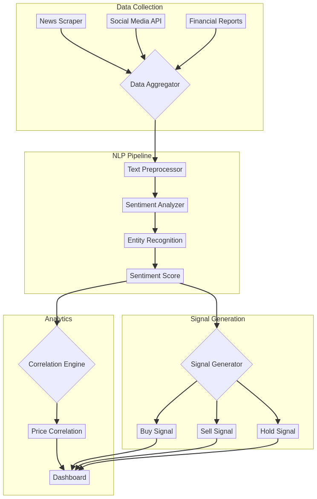

# Sentiment Analysis for Trading em Rust

 

---

## 🇧🇷 Visão Geral (Português)

Um sistema que utiliza Processamento de Linguagem Natural (NLP) para analisar o sentimento de notícias e redes sociais, gerando sinais de trading a partir de dados alternativos.

### Funcionalidades
- **Web Scraping:** Coleta de notícias de portais financeiros.
- **Análise de Sentimento:** Modelos de NLP para classificar o sentimento do texto.
- **Geração de Sinais:** Criação de sinais de compra/venda baseados no sentimento do mercado.

### Arquitetura


---

## 🇺🇸 Overview (English)

A system that uses Natural Language Processing (NLP) to analyze the sentiment of news and social media, generating trading signals from alternative data.

### Features
- **Web Scraping:** Collection of news from financial portals.
- **Sentiment Analysis:** NLP models to classify text sentiment.
- **Signal Generation:** Creation of buy/sell signals based on market sentiment.

### Architecture


---

## 🚀 Getting Started

```sh
git clone https://github.com/galafis/rust-sentiment-analysis-trading.git
cd rust-sentiment-analysis-trading
cargo build --release
cargo run --release
```

## 📜 Licença (License)

MIT License - Copyright (c) 2025 Gabriel Demetrios Lafis
