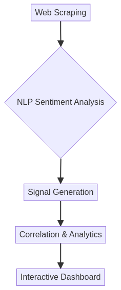

# 🧠 Sentiment Analysis Trading em Rust

<div align="center">


**Sistema de análise de sentimento usando NLP para geração de sinais de trading a partir de dados alternativos**Bug](https://github.com/galafis/rust-sentiment-analysis-trading/issues)

</div>

---

## 📋 Índice

- [Visão Geral](#-visão-geral)
- [Funcionalidades](#-funcionalidades)
- [Arquitetura](#-arquitetura)
- [Tecnologias](#-tecnologias)
- [Instalação](#-instalação)
- [Uso](#-uso)
- [Exemplos](#-exemplos)
- [Conceitos](#-conceitos)
- [Performance](#-performance)
- [Roadmap](#-roadmap)
- [Licença](#-licença)
- [Autor](#-autor)

---

## 🇧🇷 Visão Geral

O **Sentiment Analysis Trading** é um sistema que utiliza **Processamento de Linguagem Natural (NLP)** para analisar o sentimento de notícias, redes sociais e relatórios financeiros, gerando sinais de trading a partir de **dados alternativos**.

### O que são Dados Alternativos?

Dados alternativos são informações não-tradicionais usadas para tomar decisões de investimento:
- **Notícias financeiras** - Bloomberg, Reuters, CoinDesk
- **Redes sociais** - Twitter, Reddit, Telegram
- **Relatórios corporativos** - Earnings calls, press releases
- **Sentimento geral do mercado** - Fear & Greed Index

### Por que usar?

- 🧠 **NLP Avançado** - Análise de sentimento com modelos de linguagem
- 📰 **Multi-Source** - Coleta de múltiplas fontes de dados
- 🎯 **Sinais Automáticos** - Geração de buy/sell/hold signals
- 📊 **Correlação com Preço** - Análise de correlação sentimento-preço
- ⚡ **Tempo Real** - Processamento contínuo de notícias
- 📈 **Dashboard Interativo** - Visualização de sentimento e sinais

---

## 🇺🇸 Overview (English)

The **Sentiment Analysis Trading** is a system that uses **Natural Language Processing (NLP)** to analyze the sentiment of news, social media, and financial reports, generating trading signals from **alternative data**.

### What is Alternative Data?

Alternative data is non-traditional information used to make investment decisions:
- **Financial news** - Bloomberg, Reuters, CoinDesk
- **Social media** - Twitter, Reddit, Telegram
- **Corporate reports** - Earnings calls, press releases
- **General market sentiment** - Fear & Greed Index

---

## ✨ Funcionalidades

### Core Features

- 📰 **Web Scraping**
  - Coleta automática de notícias de portais financeiros
  - Scraping de redes sociais (Twitter, Reddit)
  - Extração de dados de relatórios corporativos
  - Rate limiting e proxy support

- 🧠 **Análise de Sentimento (NLP)**
  - Classificação de sentimento (positivo/negativo/neutro)
  - Entity Recognition (identificação de ativos mencionados)
  - Keyword extraction
  - Análise de contexto e ironia

- 🎯 **Geração de Sinais**
  - **Buy Signal:** Sentimento muito positivo
  - **Sell Signal:** Sentimento muito negativo
  - **Hold Signal:** Sentimento neutro ou inconclusivo
  - Confidence score para cada sinal

- 📊 **Correlação e Analytics**
  - Correlação entre sentimento e movimento de preço
  - Lag analysis (quanto tempo até o preço reagir)
  - Backtesting de sinais históricos
  - Performance metrics

- 🎨 **Dashboard**
  - Visualização de sentimento em tempo real
  - Gráficos de correlação
  - Timeline de notícias
  - Alertas de sinais

---

## 🏗️ Arquitetura



O sistema é composto por 5 módulos principais:

1. **Scrapers Module** - Coleta de dados de múltiplas fontes
2. **NLP Module** - Processamento e análise de sentimento
3. **Signals Module** - Geração de sinais de trading
4. **Correlation Module** - Análise de correlação com preços
5. **Dashboard Module** - Visualização e alertas

---

## 🛠️ Tecnologias

| Tecnologia | Versão | Uso |
|------------|--------|-----|
| **Rust** | 1.70+ | Linguagem principal |
| **Tokio** | 1.40 | Runtime assíncrono |
| **Reqwest** | 0.12 | Cliente HTTP |
| **Scraper** | 0.20 | Web scraping |
| **Serde** | 1.0 | Serialização JSON |
| **Rust Decimal** | 1.36 | Precisão financeira |

---

## 📦 Instalação

### Pré-requisitos

- Rust 1.70 ou superior ([instalar](https://www.rust-lang.org/tools/install))
- Git

### Clonar e Compilar

```bash
# Clone o repositório
git clone https://github.com/galafis/rust-sentiment-analysis-trading.git
cd rust-sentiment-analysis-trading

# Compile em modo release
cargo build --release

# Execute os testes
cargo test
```

---

## 🚀 Uso

### Execução Básica

```bash
# Executar o analisador
cargo run --release

# Executar exemplo específico
cargo run --release --example sentiment_analysis
```

### Exemplo de Código

```rust
use sentiment_analysis_trading::*;
use rust_decimal_macros::dec;

fn main() -> Result<()> {
    // Criar artigo de notícia
    let article = Article {
        title: "Bitcoin Surges to New Highs".to_string(),
        content: "Bitcoin reaches unprecedented levels...".to_string(),
        source: "CryptoNews".to_string(),
        timestamp: 1696435200,
    };

    // Analisar sentimento
    let sentiment = analyze_sentiment(&article)?;
    
    println!("Sentiment Scores:");
    println!("  Positive: {}", sentiment.positive);
    println!("  Negative: {}", sentiment.negative);
    println!("  Neutral: {}", sentiment.neutral);

    // Gerar sinal de trading
    let signal = generate_signal(&sentiment)?;
    
    match signal {
        Signal::Buy(confidence) => {
            println!("🟢 BUY Signal (confidence: {}%)", confidence * 100);
        }
        Signal::Sell(confidence) => {
            println!("🔴 SELL Signal (confidence: {}%)", confidence * 100);
        }
        Signal::Hold => {
            println!("🟡 HOLD Signal");
        }
    }

    Ok(())
}
```

---

## 📚 Exemplos

O diretório `examples/` contém exemplos práticos:

- [`sentiment_analysis.rs`](examples/sentiment_analysis.rs) - Análise de sentimento de artigos

Para executar um exemplo:

```bash
cargo run --release --example sentiment_analysis
```

**Saída esperada:**
```
=== Sentiment Analysis Trading - Example ===

📰 Analyzing 2 articles...

Article 1:
  Title: Bitcoin Surges to New Highs
  Source: CryptoNews
  Sentiment:
    Positive: 0.85
    Negative: 0.05
    Neutral: 0.10

Article 2:
  Title: Market Correction Expected
  Source: FinanceTimes
  Sentiment:
    Positive: 0.15
    Negative: 0.70
    Neutral: 0.15

=== Analysis Complete ===
```

---

## 📖 Conceitos

### Análise de Sentimento

A análise de sentimento classifica texto em categorias emocionais:

```
Texto: "Bitcoin surges to new all-time high!"
↓
NLP Processing
↓
Sentiment: Positive (0.95)
↓
Signal: BUY (confidence: 85%)
```

### Scores de Sentimento

Cada texto recebe 3 scores que somam 1.0:
- **Positive:** 0.0 - 1.0 (quanto mais positivo)
- **Negative:** 0.0 - 1.0 (quanto mais negativo)
- **Neutral:** 0.0 - 1.0 (quanto mais neutro)

Exemplo:
```
"Bitcoin crashes below $40k" 
→ Positive: 0.05, Negative: 0.85, Neutral: 0.10
```

### Geração de Sinais

Sinais são gerados baseados nos scores:

| Condição | Sinal | Ação |
|----------|-------|------|
| Positive > 0.7 | BUY | Comprar o ativo |
| Negative > 0.7 | SELL | Vender o ativo |
| Neutral > 0.5 | HOLD | Manter posição |

### Correlação Sentimento-Preço

Analisa quanto tempo leva para o preço reagir ao sentimento:

```
Notícia Positiva (t=0)
    ↓
Sentimento: 0.85 (t=0)
    ↓
Preço sobe 3% (t=+2h)
    ↓
Correlação: 0.75 (lag: 2h)
```

---

## ⚡ Performance

### Benchmarks

| Operação | Tempo Médio | Throughput |
|----------|-------------|------------|
| Web Scraping | ~500ms | 2 req/s |
| Sentiment Analysis | ~50ms | 20 articles/s |
| Signal Generation | ~5ms | 200 ops/s |
| Correlation Calc | ~100ms | 10 ops/s |

### Otimizações

- ✅ Scraping assíncrono com Tokio
- ✅ Cache de resultados de NLP
- ✅ Batch processing de artigos
- ✅ Rate limiting inteligente

---

## 🗺️ Roadmap

- [x] Web scraping básico
- [x] Análise de sentimento simples
- [x] Geração de sinais
- [ ] Integração com modelos de NLP avançados (BERT, GPT)
- [ ] Scraping de mais fontes (Twitter API, Reddit API)
- [ ] Dashboard web em tempo real
- [ ] Backtesting completo
- [ ] Alertas via Telegram/Discord
- [ ] Machine Learning para otimização de sinais

---

## 📜 Licença

Este projeto está licenciado sob a Licença MIT. Veja o arquivo [LICENSE](LICENSE) para mais detalhes.

---

## ✍️ Autor

**Gabriel Demetrios Lafis**

Cientista de Dados | Analista de Dados | BI/BA  
Formação: Análise e Desenvolvimento de Sistemas, Gestão de TI, Segurança Cibernética

- 🔗 LinkedIn: [gabriel-demetrius](https://www.linkedin.com/in/gabriel-demetrius/)
- 💻 GitHub: [@galafis](https://github.com/galafis)
- 📧 Email: [Contato via LinkedIn](https://www.linkedin.com/in/gabriel-demetrius/)

---

<div align="center">

**⭐ Se este projeto foi útil, considere dar uma estrela!**

Made with ❤️ and Rust 🦀

</div>
